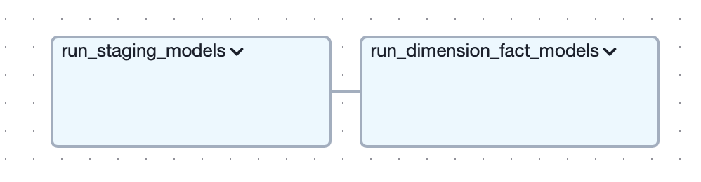

# YouTube Video Performance and Engagement Analysis

## Overview  
This project, **YouTube Video Performance and Engagement Analysis**, is an end-to-end data engineering pipeline designed to extract, transform, and analyze weekly data from the YouTube API. The pipeline captures trending video metrics, comments, and descriptive metadata to provide insights into video performance and audience engagement across different regions.  

The project utilizes modern data engineering tools and workflows, integrating technologies such as Google Cloud Platform (GCP), Airflow, dbt, and Metabase for data extraction, transformation, storage, and visualization.

---

## Architecture  
### Key Features:  
- **Automated Weekly Data Extraction**: Fetches YouTube video and comment data, including metrics like views, likes, and comments.  
- **Dimensional Modeling**: Organizes data into fact and dimension tables for efficient querying and analysis.  
- **Cloud Storage and BigQuery Integration**: Processes and stores data in GCP for scalability and performance.  
- **Interactive Dashboard**: Visualizes trends and insights using Metabase.  

---

## Tech Stack  
- **Programming Language**: Python, SQL 
- **Data Orchestration**: Apache Airflow  
- **Data Transformation**: DBT (SQL)
- **Data Storage**: Google Cloud Storage, BigQuery  
- **Visualization**: Metabase  
- **Version Control**: Git  

---

## Data Model  

## Data Model  
The data model consists of the following tables, categorized into dimensions and facts, along with their relationships:

### Dimension Tables:

#### **dim_channels:**

- **Fields:**
  - `channel_id` (Primary Key, string): Unique identifier for each channel.
  - `channel_name` (string): Name of the channel.
  - `channel_description` (string): Description of the channel.
  - `channel_published_at` (timestamp): Date and time when the channel was created.

#### **dim_categories:**

- **Fields:**
  - `category_id` (Primary Key, integer): Unique identifier for each category.
  - `category_name` (string): Name of the category.
  - `category_description` (string): Description of the category.

#### **dim_regions:**

- **Fields:**
  - `region_code` (Primary Key, string): Unique code representing a region.
  - `region_name` (string): Name of the region.

#### **dim_videos:**

- **Fields:**
  - `video_id` (Primary Key, string): Unique identifier for each video.
  - `title` (string): Title of the video.
  - `description` (string): Description of the video.
  - `channel_id` (string): Foreign key referencing `dim_channels.channel_id`.
  - `category_id` (integer): Foreign key referencing `dim_categories.category_id`.

### Fact Tables:

#### **fact_video_metrics:**

- **Fields:**
  - `fact_video_id` (Primary Key, string): Unique identifier for video metrics.
  - `video_id` (string): Foreign key referencing `dim_videos.video_id`.
  - `region_code` (string): Foreign key referencing `dim_regions.region_code`.
  - `view_count` (integer): Number of views the video received.
  - `like_count` (integer): Number of likes the video received.
  - `comment_count` (integer): Number of comments on the video.
  - `published_at` (timestamp): Date and time when the metrics were recorded.

#### **fact_video_comments:**

- **Fields:**
  - `fact_comment_id` (Primary Key, string): Unique identifier for video comments.
  - `comment_id` (string): Identifier for each comment.
  - `video_id` (string): Foreign key referencing `dim_videos.video_id`.
  - `comment_author` (string): Author of the comment.
  - `comment_text` (string): Content of the comment.
  - `like_count` (integer): Number of likes the comment received.
  - `published_at` (timestamp): Date and time when the comment was published.

### Relationships:
- `dim_channels` is related to `dim_videos` via `channel_id`.
- `dim_categories` is related to `dim_videos` via `category_id`.
- `dim_regions` is related to `fact_video_metrics` via `region_code`.
- `dim_videos` is related to both `fact_video_metrics` and `fact_video_comments` via `video_id`.

---

## Workflow  

### ELT Diagram

### Extraction and Loading Diagram

- **extract_and_save_to_local**: A task that is responsible for executing a python script that will request data from youtube api.
- **upload_files_to_gcs**: A task that will upload the extracted data to GCS bucket as ".ndjson".
- **check_and_create_youtube_dataset **: A task that will create an empty dataset in Google Big Query if not yet created. 
- **get_most_recent_file**: A task that will get the specific youtube data most recent file. 
- **load_data_to_bq**: A task that will load the latest youtube data in GCS to Big Query. 

### Transform Diagram

- **run_staging_models**: A task that will build the staging models.
- **run_dimension_fact_models**: A task that will build the dimension and fact tables.

### Main DAG Diagram (orchestrator)

- **trigger_load_to_gcs**: A task that will execute the extraction and loading DAG.
- **trigger_transform_youtube_data**: A task that will execute the transform DAG.

---

## Dashboard Highlights  
The **YouTube Analytics Dashboard** includes:  
- **Video Performance Trends**: Visualize weekly changes in views, likes, and comments.  
- **Audience Engagement**: Analyze top-performing videos and comments by region and category.  

---

